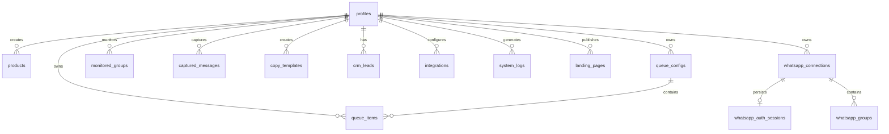

# Database Schema

## Entity-Relationship Diagram



## Tables

### `whatsapp_connections`
Até cinco registros por usuário. Não existe `UNIQUE(user_id)`.
- `id` (uuid, PK)
- `user_id` (uuid, FK to auth.users.id)
- `label` (text)
- `phone`, `display_name` (text, nullable)
- `status` (text)
- `connected_at`, `last_seen_at`, `created_at`, `updated_at` (timestamptz)

### `whatsapp_auth_sessions`
Estado técnico criptografado no backend; sem policy para `anon` ou `authenticated`.
- `connection_id` (uuid, PK/FK)
- `encrypted_state` (text, AES-256-GCM)
- `created_at`, `updated_at` (timestamptz)

### `whatsapp_groups`
- `id` (uuid, PK)
- `user_id`, `connection_id` (uuid, FK)
- `external_group_id`, `name` (text)
- `participants_count` (integer)
- `sync_status` (`active` ou `unavailable`)
- `last_synced_at`, `created_at`, `updated_at` (timestamptz)
- `UNIQUE(connection_id, external_group_id)`

### `profiles`
User profiles, linked to Supabase Auth (`auth.users`).
- `id` (uuid, PK, FK to auth.users.id)
- `full_name` (text)
- `email` (text)
- `avatar_url` (text)
- `created_at` (timestamp)
- `updated_at` (timestamp)

### `products`
Products scraped or manually added by the user.
- `id` (text, PK)
- `user_id` (uuid, FK to profiles.id)
- `title` (text)
- `original_price` (numeric)
- `price` (numeric)
- `discount_percent` (numeric)
- `rating` (numeric)
- `reviews_count` (integer)
- `category` (text)
- `marketplace` (text)
- `raw_url` (text)
- `affiliate_url` (text)
- `coupon_code` (text)
- `image` (text)
- `status` (text)
- `is_favorite` (boolean)
- `is_archived` (boolean)
- `collection_id` (text)
- `hot_score` (integer)
- `created_at` (timestamp)
- `updated_at` (timestamp)

### `queue_configs`
Configuration for automated message dispatching.
- `id` (text, PK)
- `user_id` (uuid, FK)
- `name` (text)
- `platform` (text)
- `channel_name` (text)
- `channel_id` (text)
- `status` (text)
- `interval_minutes` (integer)
- `auto_shuffle` (boolean)
- `peak_hours_only` (boolean)
- `days_of_week` (jsonb)
- `time_window_start` (time)
- `time_window_end` (time)
- `next_delivery_time` (timestamp)
- `last_delivery_time` (timestamp)
- `total_pending` (integer)
- `total_sent` (integer)
- `total_failed` (integer)
- `created_at` (timestamp)

### `queue_items`
Individual items scheduled for dispatch.
- `id` (text, PK)
- `user_id` (uuid, FK)
- `queue_config_id` (text, FK)
- `product_id` (text)
- `product_title` (text)
- `product_image` (text)
- `price` (numeric)
- `original_price` (numeric)
- `marketplace` (text)
- `copy_text` (text)
- `affiliate_url` (text)
- `channel_ids` (jsonb)
- `scheduled_for` (timestamp)
- `sent_at` (timestamp)
- `status` (text)
- `priority` (integer)
- `error_message` (text)
- `created_at` (timestamp)

### `monitored_groups`
Groups monitored for incoming offers.
- `id` (text, PK)
- `user_id` (uuid, FK)
- `name` (text)
- `platform` (text)
- `external_id_or_url` (text)
- `linked_store` (text)
- `status` (text)
- `captured_count` (integer)
- `approved_count` (integer)
- `last_activity` (timestamp)
- `rules` (jsonb)
- `created_at` (timestamp)

### `captured_messages`
Messages captured from monitored groups.
- `id` (text, PK)
- `user_id` (uuid, FK)
- `group_id` (text)
- `group_name` (text)
- `platform` (text)
- `raw_content` (text)
- `image_url` (text)
- `extracted_json` (jsonb)
- `confidence` (numeric)
- `status` (text)
- `template_used_id` (text)
- `final_text` (text)
- `created_at` (timestamp)

### `copy_templates`
Templates for generating marketing copy.
- `id` (text, PK)
- `user_id` (uuid, FK)
- `title` (text)
- `category` (text)
- `store` (text)
- `content` (text)
- `usage_count` (integer)
- `is_favorite` (boolean)
- `status` (text)
- `is_default` (boolean)
- `created_at` (timestamp)

### `crm_leads`
Customer relationships and engagement metrics.
- `id` (text, PK)
- `user_id` (uuid, FK)
- `name` (text)
- `handle_or_phone` (text)
- `platform` (text)
- `tags` (jsonb)
- `engagement_score` (numeric)
- `total_clicks` (integer)
- `last_active` (timestamp)
- `created_at` (timestamp)

### `integrations`
User integrations with external services.
- `id` (text, PK)
- `user_id` (uuid, FK)
- `key` (text)
- `name` (text)
- `category` (text)
- `logo_icon_name` (text)
- `status` (text)
- `tag_afiliado` (text)
- `api_key` (text)
- `webhook_url` (text)
- `last_sync` (timestamp)
- `description` (text)
- `logs_count` (integer)
- `created_at` (timestamp)

### `system_logs`
Logs of system events and errors.
- `id` (text, PK)
- `user_id` (uuid, FK)
- `timestamp` (timestamp)
- `level` (text)
- `module` (text)
- `message` (text)
- `details` (text)
- `created_at` (timestamp)

### `landing_pages`
Landing pages generated by the user.
- `id` (text, PK)
- `user_id` (uuid, FK)
- `title` (text)
- `slug` (text)
- `views` (integer)
- `clicks` (integer)
- `conversion_rate` (numeric)
- `active_products_count` (integer)
- `status` (text)
- `updated_at` (timestamp)
- `created_at` (timestamp)

## RLS Policies
All tables feature Row Level Security (RLS). Standard policy for most tables ensures that users can only access and modify their own records:

```sql
CREATE POLICY "Users can manage their own data"
ON table_name
FOR ALL
USING (auth.uid() = user_id);
```

## Triggers

### `handle_new_user()`
A database trigger linked to `auth.users` on `INSERT`. When a new user signs up in Supabase Auth, this function automatically creates a corresponding record in the `profiles` table.

```sql
CREATE OR REPLACE FUNCTION public.handle_new_user()
RETURNS trigger AS $$
BEGIN
  INSERT INTO public.profiles (id, full_name, email, avatar_url)
  VALUES (
    new.id,
    new.raw_user_meta_data->>'full_name',
    new.email,
    new.raw_user_meta_data->>'avatar_url'
  );
  RETURN new;
END;
$$ LANGUAGE plpgsql SECURITY DEFINER;

CREATE TRIGGER on_auth_user_created
  AFTER INSERT ON auth.users
  FOR EACH ROW EXECUTE PROCEDURE public.handle_new_user();
```
